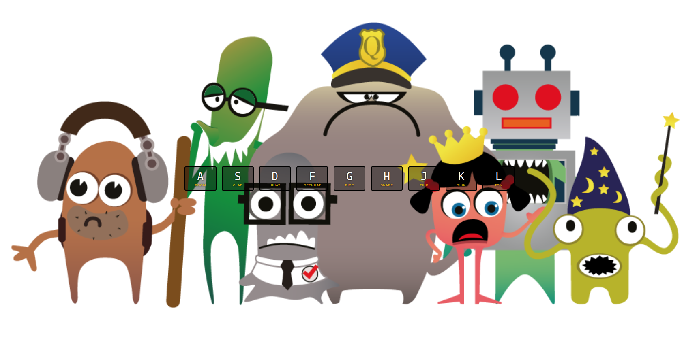

# Day 01 - JavaScript Drum Kit ✅



## Key takeways:

### HTML

Today I learned the HTML tag: `<kbd>`.
- it's use to define a keyboard input.
- In this case, we use to structure our HTML code with letter we will use to play our Drum Kit
```html
 <kbd>A</kbd>
```
use `data-*` to customize the `<div>` with the key code number attribute:

```html
    <div data-key="65" class="key">
        <kbd>A</kbd>
        <span class="sound">clap</span>
    </div>
```

### JavaScript

Using the HTML attribute `data-key` to select the tag audio and key code number:

```javascript
    const audio = document.querySelector(`audio[data-key="${e.keyCode}"]`);
    const key = document.querySelector(`.key[data-key="${e.keyCode}"]`);
```


To eleminate the keys we don't use:

```javascript
    if(!audio) return;
```


About the delay key problem, he set the `currentTime` to `0`:

```javascript
    audio.currentTime = 0;
```

And then we can play it!

```javascript
    audio.play();
```

Ok! We can have a funniest play it! But we have some problems here. When we press the keydown and we take our fingers and we have the keyup moviment, the previous animation doesn't disappear. 


To solve it, Wes selected all classes `.key`, he ran through an array to take the `transitionend` event listener, which show us when transition aninmation ends.

With this information, we can take the property name to discover when to remove the animation `.playing` class:

```javascript

    function removeTransition(e) {
        if(e.propertyName !== 'transform') return;
        this.classList.remove('playing');
    }

    const keys = document.querySelectorAll('.key');
    keys.forEach(key => key.addEventListener('transitionend', removeTransition));
```
